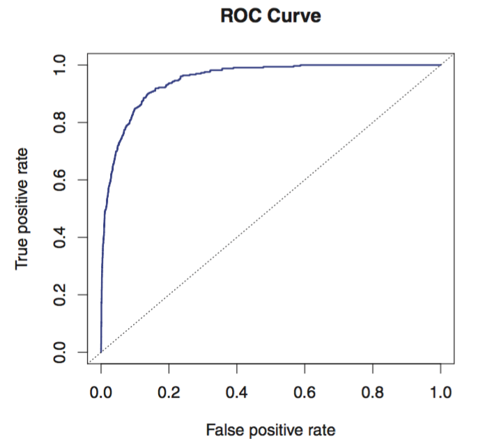

# Chapter 4: Classification
## Overview
We generally try to find the probabilities that a given observation $x_0$ belongs to a class $k$. 

---
## Pitfalls of Linear Regression
1. We can use linear regression to encode variables that have binary encodings (or just 2 levels). We can use linear regression to encode variables that have some inherent ordering or equal relative distance. Beyond these restrictions, however, it's difficult to use linear regression.
1. Linear regression produces a line, which can produce negative output or outputs greater than 1 for some $x$ values. This violates probabilities being on [0,1].

---
## Logistic Regression
Linear regression models predicted output given regressors. Logistic Regression models probability that the output is within a class given regressors.

### Logistic model
Let the odds of an event be defined as $\frac{p}{1-p}$. 

Let $logit(p) = ln(\frac{p}{1-p})$. We want to be able to map $logit(p)$ to some linear combinations of regressors. Let $ln(\frac{p}{1-p} = \alpha$, where $\alpha$ is the linear combination of regressors.

Note that $logit^{-1}(p) = \frac{e^{\alpha}}{1+e^{\alpha}}$. Notice that this function now has a range restricted to [0,1]. Let 

$$p(x) = \frac{e^{\alpha}}{1+e^{\alpha}} = \frac{e^{B_0 + B_1X_1}}{1+e^{B_0 + B_1X_1}}$$

Notice that $ln(\frac{p}{1-p}) = B_0 + B_1X$, a unit increase in $x$ yields a $B_1$ increase in the log-odds.

We estimate logistic coefficients by seeking estimates for $B_0$ and $B_1$ such that $P(x_i)$ yields close to 1 for observations of class 1 and close to 0 for observations of class 0. We find these coefficients by maximizing the likelihood function:

$$l(B_0,B_1) = \prod_{i:y_i=1}p(x_i) \prod_{j:y_j=0}(1-p(x_j))$$

We can measure accuracy of coefficient estimates by computing their standard errors, finding their z-statistics, and then finding their associated p-values. Large values for z-statistics indicates evidence against $H_0: B_1 = 0$.

---

## Multiple Logistic Regression

Now $ln(\frac{p}{1-p} = B_0 + B_1X_1 + ... + B_pX_p)$ and thus

$$p(x) = \frac{e^{\alpha}}{1+e^{\alpha}} = \frac{e^{B_0 + B_1X_1 + ... + B_pX_p}}{1+e^{B_0 + B_1X_1 + ... + B_pX_p}}$$

Keep in mind that we are still restricting each $X_i$ to be indicator variables. 

It's possible that we now find confounding between different variables in the multiple logistic regression setting. 

---

## Linear Discriminant Analysis
Important assumptions:
- Assume that all observations from a class $k$ follow a normal distribution.
- Shared variance of distribution of observations within each of $K$ classes. 

Note that the density function in one dimension is 

$$f_k(x) = \frac{1}{\sqrt{2\pi}\sigma}e^{\frac{-1}{2\sigma^2}(x-\mu_k)^2}$$

We let $\pi_k$ be the proportion of training data points that lie within class $k$. In other words, $\pi_k$ is the probability that a randomly selected observation lies within the class $k$.

Remember that Baye's theorem states that $P(A|B) = \frac{P(B|A)P(A)}{P(B)}$. From this, we see that 

$$P(Y=k|X=x) = \frac{P(X=x|Y=k)P(Y=k)}{\sum_{i=1}^{K}P(X=x|Y=i)P(Y=i)} = \frac{\pi_k f_k(x)}{\sum_{i=1}^{K}\pi_i f_i(x)}$$

Note that if $\pi_1f_1(x) > \pi_2f_2(x)$ then $log(\pi_1f_1(x)) > log(\pi_2f_2(x))$

Thus we can use the following linear equation to classify observations based on whether or not $\delta_1(x) > \delta_2(x)$ for some observation $x$ and two discriminant functions $\delta_1$ and $\delta_2$.

$$\delta_k(x) = log(\pi_k f_k(x)) = x\frac{\mu_k}{\sigma^2} - \frac{\mu_k^2}{2\sigma^2} + log(\pi_k)$$

However, in order to find estimates for the discriminant functions, we need to find $\hat \pi_k$, $\hat \mu_k$, $\hat \sigma$. We can use 
- $\hat \pi_k = \frac{n_k}{n}$ where $n$ is the number of observations and $n_k$ is the number of observations within a class $k$.
-  $\hat \mu_k = \frac{1}{n_k}\sum_{i:y_i = k}x_i$.
- $\hat \sigma^2 = \frac{1}{n-K}\sum_{k=1}^{K}\sum_{i:y_i=k}(x_i - \hat \mu_k)^2$

We let the decision boundary be the $x$ value for which $\delta_1(x) = \delta_2(x)$. Thus we will classify $x$ in class 1 for values of $x$ for which $\delta_1(x) > \delta_2(x)$. In general, we would like the LDA decision boundary be as close to the Bayes Decision boundary as possible, since the Bayes Decision boundary is the theoretically optimal decision boundary.

---

## Linear Discriminant Analysis for $p>1$

Assume that $X = (X_1,X_2, \ldots , X_p)$ is drawn from a multivariate Gaussian distribution with a class-specific mean vector and common covariance matrix. We say that $X \sim N(\mu, \Sigma)$, which means that $X$ has a multivariate Gaussian distribution with a mean vector $\mu$ and a covariance matrix $\Sigma$. Here's a few quick notes
- $\mu = E[X] = (E[X_1],E[X_2],\ldots,E[X_p])$
- $\Sigma$ 
  - Covariance extends idea of _variance_ to multiple dimensions
  - $\Sigma$ is a $p \times p$ matrix where $i,j$ cell is the covariance between predictors $X_i$ and $X_j$. Remember that $Cov(X,Y) = E[(X-E[X])(Y-E[Y])]$
  - Each cell along the diagonal of covariance matrix represents the covariance of a predictor $X_i$ with itself, which is nothing but the variance of $X_i$ since $Cov(X,X) = E[(X-E[X])(X-E[X])] = E[(X-E[X])^2] = Var[X]$
  - Let $E[X] = E[Y] = \mu_x = \mu_y = 0$ by centering the distributions of X and Y. In this case, $Cov(X,Y) = E[(X)(Y)] \approx \frac{1}{n}\sum_i^n X_i*Y_i$. 

Multivariate Gaussian density: 

$$f(x) = \frac{1}{(2\pi)^{p/2}|\Sigma|^{1/2}}e^{-\frac{1}{2}(x-\mu)^{T}\Sigma^{-1}(x-\mu)} $$

LDA for $p>1$ assumes that observations from each class $k$ are drawn from $N(\mu_k,\Sigma)$. $\mu_k$ is a class-specific mean vector. $\Sigma$ is a covariance matrix common to all $K$ classes (assumption). 

LDA Classifier:

$$\delta_k(x) = x^T\Sigma^{-1}\mu_k-\frac{1}{2}\mu_k^T\Sigma^{-1}\mu_k+log\pi_k$$

Notice that this is linear since the only term with any $x_i$ is $x^T$. This is a key observation when examining the differences between LDA and QDA.

*Note:* In LDA where $p>1$, we have $\binom{p}{2}$ Bayes decision boundaries.

---

## Interpereting confusion matrices in context of LDA performance on `credit` data set

> The credit data set contains information about individuals including whether or not those individuals defaulted on their loans

In a *confusion matrix*, we can see the true and false positives and negatives that result from a model. The general form of a confusion matrix is:

|       | *Predicted Class* | No           | Yes  | Total |
| ---- | ------------- |:-------------:| -----:| -----:|
|*Predicted* | No     | True Neg. | False Pos. | N |
| *Default Status* | Yes | False Neg.     | True Pos. | P |
| | Total     | N* | P* |  |

 
 For the default status in the credit card data set that results from running LDA, we obtain the following confusion matrix:

|       | *True Default status* | No           | Yes  | Total |
| ---- | ------------- |:-------------:| -----:| -----:|
|*Predicted* | No     | 9,644 | 252 | 9896 |
| *Default Status* | Yes     | 23 | 81 | 104 |
| | Total     | 9,667 | 333 | 10,000 |

We see that only 3.33% of individuals in the training sample defaulted. This means that even a *null* classifier that predicts every individual never defaults will have an error rate of 3.33%. LDA on this training set gives us an error rate of 2.75%, which is *very* close to the error rate of the *null* classifier. We can also see that of the 333 individuals that defaulted, LDA missed 252 of them (that's 75.7%!).

An important note to make here is that vanilla LDA will always minimize the *total* error rate by approximating the Bayes error rate (which stems from trying to minimize the total number of misclassifications). In this case, that's not the best idea. We might actually care more about catching defaulters than incorrectly labelling people who didn't default as defaulters. 

We can alleviate this issue by changing the threshold for classifications. For LDA, if $P(Y=k|X=x) > 0.5$ for a two-class setting, then we classify the observation $x$ into class $k$. We can reduce this threshold to assign more observations to class $k$, though some of these observations might have probabilities slightly lower than $0.5$. It's important to note that the Bayes classifier uses $0.5$ as its threshold since this threshold minimizes the total error rate in a two-class setting. Specifically in the context of predicting defaulters on credit card loans, we can change the condition satisfied for predicting `default = yes` from $P(default|X=x) > 0.5$ to $P(default|X=x) > 0.2$.

After reducing the threshold away from the threshold used by the Bayes classifier, our total error rate has to increase. However, the error rate we cared about (misclassifications of defaulters as non-defaulters) should have decreased. This is exactly what happened. LDA now misclassifies only 41% of defaulters as non-defaulters but the overall error rate increases to 3.73% (since some non-defaulters now get classified as defaulters).

---

## ROC Curve

Check out this ROC Curve. It has *False Positive Rate* on the x-axis and *True Positive Rate* on the y-axis. The ROC Curve is generated with respect to the performance of a single model tested at various thresholds.

Some key observations about the curve. Let there be class $k$ for whatever class is *positive*.
- At the point (0,0), our threshold is 1. This means that an observations needs to have a probability of 1 to be classified to $k$. Since this will never happen, no observation is ever classified to $k$ and thus our True and False positive rates are 0.
- At the point (1,1), our threshold is 0. This means that every observation gets classified to $k$. Intuitively, this implies that all observations that are not in $k$ are classified to $k$ (which makes the False Positive Rate skyrocket to 1). Similarly, all observations that are truly in $k$ are classified to $k$ (which makes the True Positive Rate also equal to 1).
- The optimal classifier performs at (0,1). This means that we have 0 false positive readings and only true positive readings. Thus, ideally, we want this curve to hug the top left corner.
- Since we want the curve to hug the top left corner, models with ROC curves of higher area (under the curve) are considered "good." 
- The dashed line in the middle is the line of the model that randomly assigns an observation to $k$. 
- The worst models classify observations in direct opposition to good models. In other words, if a good model classifies to $k$, a bad model would deliberately classify the same observation to another class. These models have areas lower than the area under the dashed line.

---

## Quadratic Discriminant Analysis

QDA is pretty much the same thing as LDA but we relax a critical assumption made during LDA. We now allow individual classes to have their own covariance matrices. In other words, instead of $\Sigma = \Sigma_i = \Sigma_j$ for all classes $i$ and $j$, we now let each class retain its own covariance matrix. 

The discriminant function (which is really long to type - just look at section 4.4.4 for the equation) now has quadratic and cross terms. Why? When we apply the log transformation to the Gaussian function that models our predictors, we end up with the term $-\frac{1}{2}x^T\Sigma_k^{-1}x$ in the resulting discriminant function. This key observation is what makes our decision boundaries *quadratic*, hend the Q in QDA. 

A few important things about QDA:
- Uses class-specific covariance matrices in the discriminant functions
- Has an error rate $\leq$ LDA model. This is because LDA does not include the quadratic terms or the cross-terms found in QDA. 
- QDA results in an elliptical Bayesian decision boundary.
- QDA generally has higher variance than LDA since it is more flexible but has lower bias. 

---

## Naive Bayes

This is a model that works surprisingly well when $p$ is large. 

Key assumption: All predictors are independent and uncorrellated with eachother. In other words, all $\Sigma_k$ are diagonal matrices. The implication of this is that Naive Bayes assumes that all predictors are uncorrellated with eachother. This might seem crazy to do; here's an intuitive reason for why it works well for large *p*:
- Generally, correllation between predictors changes the shapes and orientations of Gaussian surfaces. However, the maximum posterior probability $P(Y=k|X=x)$ may not be highly dependent on the shape and orientations of the surfaces. We care about the maximum posterior probability since the class for which its associated posterior probability is largest for a given observation is the class we assign the observation to. Anyway, making this assumption allows for much easier computation (since *p* is large) and produces similar results for the maximum posterior probability. Specifically, this assumption allows us to compute $p$ covariances for the diagonal matrix $\Sigma_k$ as opposed to $p\times p$ covariances.

Since we've assumed that the predictors are uncorrellated, we know that $X_i = x_i | Y=k$ is independent of $X_j=x_j| Y=k$ where $X_i$ and $X_j$ are individual predictors in a predictor vector $X$ and $x_i$ and $x_j$ are realizations of their respective predictors. Remember that if events A and B are independent, then $P(A\cap B) = P(A) \times P(B)$. Thus, $P(Y=k|X=x) \propto \prod_{j=1}^{p}f_{kj}(x_j)$. 

Finally, we find that the discriminant function follows the form: 

$$\delta_k(x)\propto log\left[\pi_k\prod_{j=1}^p f_{kj}(x_j)\right]$$

---

## Real Quick: LDA vs Logistic

- The log-odds in both LDA and logistic is linear
  - $log(\frac{p_1}{1-p_1})= B_0 + B_1x_1 + \ldots + B_px_p$
  - In logistic regression, estimate the parameters by maximizing the likelihood function
  - In LDA, we estimate the parameters by using estimates for $\hat{\pi_k}$, $\hat{\sigma_k}$, and $\hat{\mu_k}$
- For an observation $x$ that truly belongs to calss $k$, both models strive to make the probability that $x$ belongs to $k$ the maximum. In other words, both models strive to correctly maximize the posterior probabilities.
- Logistic regression assumes that $P(Y=k|X=x)$ is sigmoidal. LDA assumes that $P(X=x|Y=k)$ is normal.

